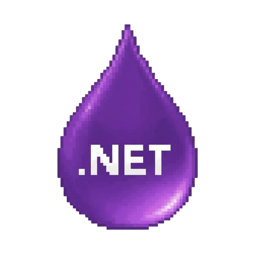
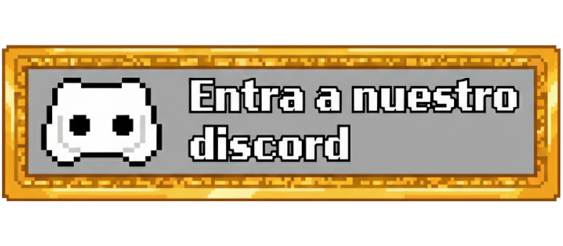
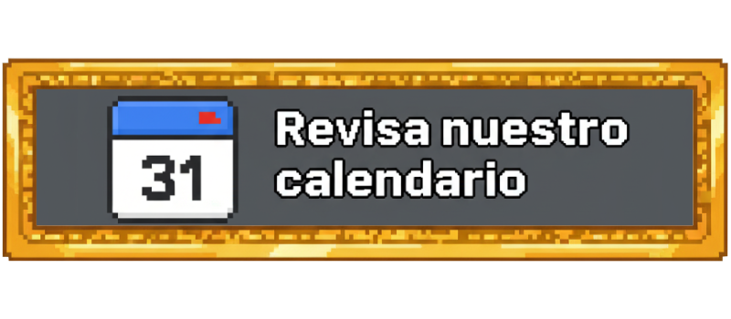
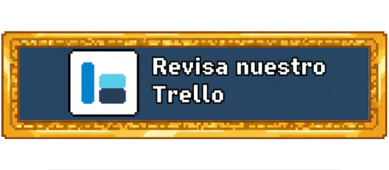

# PII_Proyecto - Programación 2

## Acerca del equipo

**Equipo:** Elixir.NET 



**Integrantes:**
- Lucas Chiappini
- Emmanuel Aristov
- Nicolas Diaz

**Enlaces de interes:**

<a href="https://discord.gg/JEuNjdv5VX">

</a>

<a href="https://calendar.google.com/calendar/u/0?cid=NzRjNDc2ZTlmZjRiYzRjOGUxY2JmN2Y5Y2FjN2UxYjY1YzM3MDExZjFjYjdkYTBkZTgxMWRlMjU5MDZlNzcxMEBncm91cC5jYWxlbmRhci5nb29nbGUuY29t">

</a>

<a href="https://trello.com/invite/67ec32604a5ebfe42e2dd5e8/ATTIc2eb1e1268dda3066be2dbee8117fff2863FFE0D">

</a>

---
## Descripción del proyecto

Este proyecto se desarrolló como parte de la materia **Programación 2**.  
El objetivo principal del proyecto fue hacer un chatbot o bot conversacional es un programa que simula mantener una conversación con una persona al proveer respuestas automáticas a entradas hechas por el usuario. Este chatbot estará en nuestro CRM.

---

## Documentacion
- [**Diagrama De Clases**](https://drive.google.com/file/d/16YVQckIlGIAxlRlldSShdRhSol4TAcct/view?usp=sharing)
- [**Informe & Tarjetas CRC**](https://docs.google.com/document/d/1IcK2Qds76VBsQNn_tbTL15GHuroAupoT/edit?usp=drive_link&ouid=114373684461076415920&rtpof=true&sd=true)
- [**Historias De Usuario BOT CORE**](https://docs.google.com/document/d/1gokicN-E-mH8XW8sk8x3_lTA2epfpu3lMCv_7lvzzlI/edit?tab=t.0)
## Notas de reflexión del equipo

- **Desafíos más difíciles:
  Para nosotros, los desafíos más difíciles fueron entender correctamente la consigna, ya que en algunos casos, al momento de tomar decisiones, la redacción generaba confusiones o redundancias.
                            Además, comprender la parte del Bot Core y determinar hasta qué punto avanzar correctamente también representó una dificultad.
                            Aun así, fue una muy buena experiencia, ya que pudimos practicar la aplicación de patrones de diseño y reflexionar sobre si estábamos utilizando los principios SOLID y GRASP de forma adecuada.
                            Otro de los desafíos fue ordenar el código existente. Nos llevó tiempo aplicar los comentarios, generar la documentación con Doxygen y mantener una estructura clara y organizada del proyecto.**  

- **Aprendizajes extra-clase:
  Trabajamos en mejorar la calidad de nuestras historias de usuario, buscando que fueran más profesionales.
                              Para ello, consultamos videos en YouTube, así como un artículo y un libro que citamos en el documento “Historias de Usuario BOT CORE”.**  
 

- **Recursos útiles:
  En cuanto a los recursos utilizados para la documentación, empleamos diversas fuentes que nos ayudaron a comprender mejor las buenas prácticas de redacción, organización y presentación de información técnica.
                     Como Refactoring.Guru, YouTube**  
  

- **Otras reflexiones o comentarios:
  Realizar un sistema de recepción y envios de mensajes escalable y extensible para futuramente implementar con la API fue un verdadero desafío pues al desconocer a ciencia cierta
                                     el funcionamiento de las APIs tener que diseñar el botcore a "ciegas" no fue nada facil, afortunadamente aplicando ciertas caracteristicas del patrón SOLID se pudo lograr un diseño prometedor.**  
 

---

## Tecnologías utilizadas

- Lenguaje principal: C#  
- Frameworks o librerías:  
- Herramientas de control de versiones: Git y GitHub
- Herramienta de gestión de proyecto: Trello

---

## Cómo ejecutar el proyecto

1. Clonar el repositorio:  
```bash
git clone https://github.com/LucasChiappini/PII_Proyecto.git

