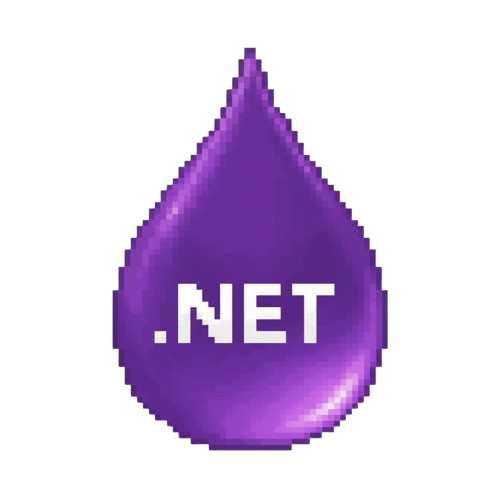
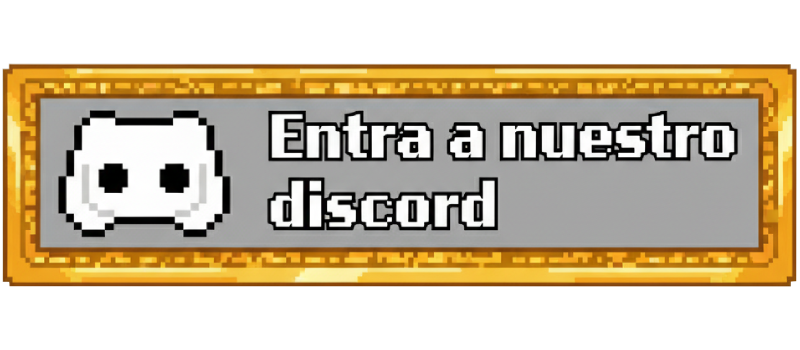
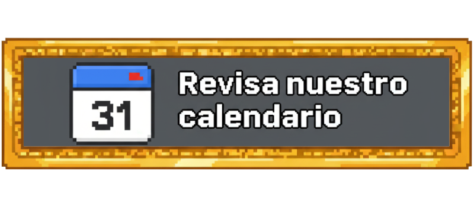
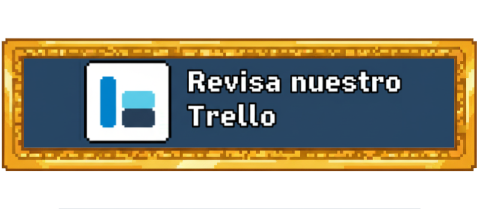

# PII_Proyecto - Programación 2

## Acerca del equipo

**Equipo:** Elixir.NET 



**Integrantes:**
- Lucas Chiappini
- Emmanuel Aristov
- Nicolas Diaz

**Enlaces de interes:**

<a href="https://discord.gg/JEuNjdv5VX](https://discord.gg/sGzCKUBbX2">

</a>

<a href="https://calendar.google.com/calendar/u/0?cid=NzRjNDc2ZTlmZjRiYzRjOGUxY2JmN2Y5Y2FjN2UxYjY1YzM3MDExZjFjYjdkYTBkZTgxMWRlMjU5MDZlNzcxMEBncm91cC5jYWxlbmRhci5nb29nbGUuY29t">

</a>

<a href="https://trello.com/invite/67ec32604a5ebfe42e2dd5e8/ATTIc2eb1e1268dda3066be2dbee8117fff2863FFE0D">

</a>


---
## Descripción del proyecto

Este proyecto se desarrolló como parte de la materia **Programación 2**.  
El objetivo principal del proyecto fue hacer un chatbot o bot conversacional es un programa que simula mantener una conversación con una persona al proveer respuestas automáticas a entradas hechas por el usuario. Este chatbot estará en nuestro CRM.

---

## Documentacion
- [**Documentación PDF (Doxygen):**](https://drive.google.com/file/d/1VcWxWLcRYa_CCIBnugpVU7KaTbw_-0lX/view?usp=sharing)
- [**Diagrama De Clases**](https://drive.google.com/file/d/16YVQckIlGIAxlRlldSShdRhSol4TAcct/view?usp=sharing)
- [**Informe & Tarjetas CRC**](https://docs.google.com/document/d/1IcK2Qds76VBsQNn_tbTL15GHuroAupoT/edit?usp=drive_link&ouid=114373684461076415920&rtpof=true&sd=true)
- [**Historias De Usuario BOT CORE**](https://docs.google.com/document/d/1gokicN-E-mH8XW8sk8x3_lTA2epfpu3lMCv_7lvzzlI/edit?tab=t.0)
- [**Flujo de la lógica**](https://docs.google.com/document/d/1RTaWC1s5vCUZR3403XroSm7rdRrt_VOOXBJ4RUGmzsE/edit?tab=t.0)
- [**Video BOT CORE**](https://www.youtube.com/watch?v=doZsXBkPkL8)

## Organización del Trabajo

Para llevar adelante este proyecto utilizamos un espacio de trabajo en Trello, donde estructuramos nuestras tareas y avances de forma organizada y visual. Nuestra organización se basó en varios tableros específicos:

- **Bitácora:** registro del progreso diario y decisiones tomadas durante el desarrollo.
- **Historias de Usuario:** espacio donde definimos las funcionalidades desde la perspectiva del usuario final.
- **Scrum History:** repositorio donde archivamos y documentamos lo realizado en semanas anteriores, manteniendo un registro histórico del proyecto.

---

## ⚙️ Scrum Board

El **Scrum Board** fue el tablero principal de trabajo del equipo, donde gestionamos el desarrollo del chatbot utilizando la metodología Scrum.  
Durante la mayor parte del proyecto trabajamos con **sprints de una semana**, y en las etapas finales, debido a una mayor carga de integración y ajustes, implementamos **sprints de dos semanas**.

El flujo de trabajo se organizó en las siguientes listas:

- **📝 To Do:** tareas planificadas para el sprint actual.
- **⚙️ Work in Progress:** tareas actualmente en desarrollo.
- **✅ Done:** tareas completadas durante la semana.
- **🗓️ Retrospectiva:** registro de la reunión semanal con puntos positivos, mejoras y acciones futuras.
- **📦 Send To Scrum History:** atajo para enviar rápidamente las tareas completadas al tablero **Scrum History**.

Cada fin de semana (o cada dos semanas, según la duración del sprint) realizamos una **reunión de retrospectiva** y, al cerrar el sprint, enviamos las tarjetas completadas al tablero **Scrum History**, donde se conserva el registro histórico del avance del proyecto.  

**Y así quedó todo nuestro chequeo del trabajo en nuestro Scrum History, reflejando de forma ordenada y transparente cada avance que logramos durante todo el proceso.**


Esta es la **versión final** de nuestro Scrum History.  
En algunos momentos del proyecto llegamos a no completar ciertas tareas dentro del sprint, pero gracias a la retrospectiva y a la reorganización continua del equipo pudimos **reacomodarlas**, integrarlas y darles cierre de forma efectiva durante el proceso.
  
## Notas de reflexión del equipo

- **Desafíos más difíciles:
  Para nosotros, los desafíos más difíciles fueron entender correctamente la consigna, ya que en algunos casos, al momento de tomar decisiones, la redacción generaba confusiones o redundancias.
                            Además, comprender la parte del Bot Core y determinar hasta qué punto avanzar correctamente también representó una dificultad.
                            Aun así, fue una muy buena experiencia, ya que pudimos practicar la aplicación de patrones de diseño y reflexionar sobre si estábamos utilizando los principios SOLID y GRASP de forma adecuada.
                            Otro de los desafíos fue ordenar el código existente. Nos llevó tiempo aplicar los comentarios, generar la documentación con Doxygen y mantener una estructura clara y organizada del proyecto.
                            Otro desafío fue poder implementar el bot de discord ya que no teníamos idea de como funcinaba la librería Discord.NET**  

- **Aprendizajes extra-clase:
  Trabajamos en mejorar la calidad de nuestras historias de usuario, buscando que fueran más profesionales.
                              Para ello, consultamos videos en YouTube, así como un artículo y un libro que citamos en el documento “Historias de Usuario BOT CORE”.**  
 

- **Recursos útiles:
  En cuanto a los recursos utilizados para la documentación, empleamos diversas fuentes que nos ayudaron a comprender mejor las buenas prácticas de redacción, organización y presentación de información técnica.
                     Como Refactoring.Guru, YouTube**  
  

- **Otras reflexiones o comentarios:
  Realizar un sistema de recepción y envios de mensajes escalable y extensible para futuramente implementar con la API fue un verdadero desafío pues al desconocer a ciencia cierta
                                     el funcionamiento de las APIs tener que diseñar el botcore a "ciegas" no fue nada facil, afortunadamente aplicando ciertas caracteristicas del patrón SOLID se pudo lograr un diseño prometedor.**  
 
## Reflexión Final del Proyecto

 **Por último, este tipo de proyecto no solo nos ayudó a mejorar nuestras habilidades técnicas, sino también a tener la posibilidad de trabajar en grupo y fortalecer habilidades blandas, como por ejemplo la comunicación, teniendo en cuenta que es una de las más importantes a la hora de trabajar: "_si algo no se comunica, no se entiende, no se integra y no avanza_". Por otro lado, también nos permitió mejorar la organización, el orden y el respeto a lo largo de todo el proceso de este proyecto.**

---

## Agradecimientos

Queremos expresar nuestro agradecimiento a:

- Nuestro profesor **Jorge Martínez**
- Nuestra ayudante **Juana López** 
- **Nuestras familias**, por su apoyo, comprensión y acompañamiento durante todo este proceso.


---

## Tecnologías utilizadas

- Lenguaje principal: C#  
- Frameworks o librerías: Discord.NET 
- Herramientas de control de versiones: Git y GitHub
- Herramienta de gestión de proyecto: Trello
- Api: Discord API
- Herramientas generales: Canva, Doxygen, ClipChamp, Microsoft Word
- IDE: Jetbrains Rider

---

## Cómo ejecutar el proyecto

1. Clonar el repositorio:  
```bash
git clone https://github.com/LucasChiappini/PII_Proyecto.git

